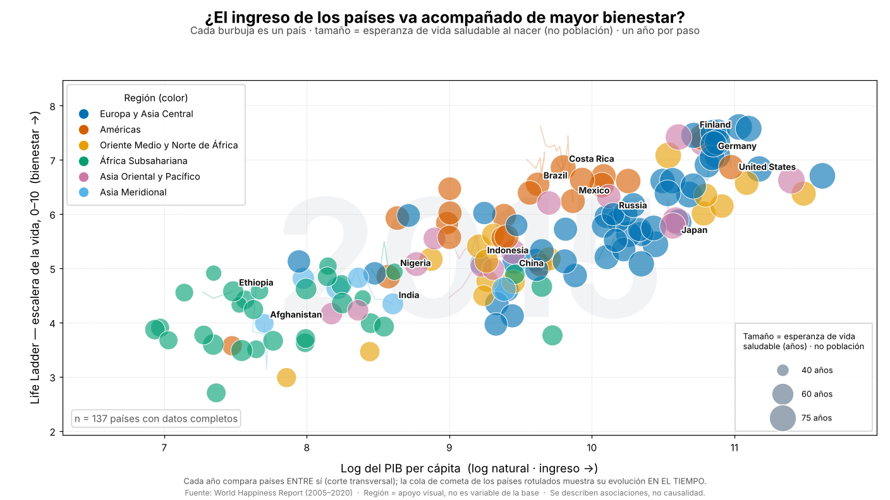

# Ingreso y bienestar de los países — animación tipo Hans Rosling

Proyecto de ciencia de datos que construye un **video MP4 animado** (estilo
Gapminder / Hans Rosling) con el *World Happiness Report* para explorar la
pregunta:

> **¿La evolución del ingreso de los países a través del tiempo está acompañada
> por cambios en sus niveles de bienestar?**



La **animación principal** (`output/video_final.mp4`) muestra, un año por paso:

| Canal visual | Variable |
|---|---|
| Eje X | `Log GDP per capita` (ingreso) |
| Eje Y | `Life Ladder` (bienestar subjetivo, 0–10) |
| Tamaño de burbuja | `Healthy life expectancy at birth` |
| Color | región geográfica (solo apoyo visual, **no** es variable de la base) |
| Etiqueta | `Country name` (conjunto curado de 14 países) |
| Tiempo | `year` (2005–2020) |

---

## 1. Qué hace el proyecto

1. **Descarga/carga** la base `world-happiness-report.csv`.
2. **Inspecciona** su estructura (observaciones, países, años, variables,
   tipos, faltantes, cobertura por año, duplicados).
3. **Limpia** los datos con criterios documentados (sin imputaciones
   arbitrarias).
4. **Analiza** la relación ingreso–bienestar de forma **descriptiva y de
   asociación** (nunca causal): transversal por año, intrapaís en el tiempo, y
   cambios de largo plazo.
5. **Genera** la animación MP4 y gráficos estáticos de apoyo.
6. **Verifica** que el video exista y sea válido (duración, resolución, cuadros).

---

## 2. Estructura y archivos generados

```
Ejercicio_Clase/
├── data/
│   └── world-happiness-report.csv        # base cruda (se descarga sola)
├── src/
│   ├── config.py                         # rutas, constantes, descarga
│   ├── regiones.py                        # mapa país→región (apoyo visual)
│   ├── inspeccion_datos.py                # inspección + limpieza
│   ├── analisis.py                        # análisis descriptivo + resumen
│   ├── graficos.py                        # gráficos estáticos de apoyo
│   ├── animacion.py                       # animación (video_final.mp4)
│   ├── verificar_video.py                 # verificación del MP4
│   └── run_all.py                         # ejecuta TODO el pipeline
├── output/
│   ├── video_final.mp4                    # ← ENTREGABLE principal
│   ├── resumen_datos.csv                  # resumen por año (+ correlaciones)
│   ├── datos_limpios_animacion.csv        # dataset limpio usado para graficar
│   ├── reporte_analisis.md                # reporte completo del análisis
│   └── figures/                           # cuadros estáticos + gráficos de apoyo
│       ├── frame_2005.png … frame_2020.png
│       ├── correlacion_por_anio.png
│       └── cambios_largo_plazo.png
├── requirements.txt
└── README.md
```

---

## 3. Decisiones de limpieza

- **BOM UTF-8:** la base se lee con `encoding='utf-8-sig'` (la primera columna
  trae un BOM).
- **Faltantes (sin imputar):** una burbuja requiere valores reales de X, Y y
  tamaño. Se eliminan por lista (*listwise*) **solo** las filas sin
  `Log GDP per capita`, `Life Ladder` o `Healthy life expectancy`. Las variables
  que no se grafican no se usan como criterio de exclusión.
  Resultado: de **1 949** filas se conservan **1 876** (96.3 %), con **159**
  países, 2005–2020. No se imputa ningún valor para no inventar posiciones.
- **Duplicados:** se verifica (país, año); la base no tiene duplicados.
- **Cobertura desigual por año:** el número de países varía (27 en 2005, ~140 en
  años centrales, 88 en 2020); el video muestra el conteo de países en cada
  cuadro para no sobreinterpretar la animación.
- **Región (color):** **no** es una variable de la base. Es una agrupación
  geográfica externa (Banco Mundial, 6 grupos) añadida solo para colorear; no
  interviene en ningún cálculo ni conclusión.

Detalle completo en [`output/reporte_analisis.md`](output/reporte_analisis.md).

---

## 4. Principales resultados (asociación, no causalidad)

- **Entre países (transversal):** asociación positiva **fuerte y estable**
  (Pearson ≈ 0.79; por año entre 0.68 y 0.85).
- **Dentro de cada país (en el tiempo):** asociación **más débil y heterogénea**
  (correlación temporal mediana ≈ 0.27; 1 de cada 3 países se mueve en sentido
  contrario).
- **Largo plazo:** de 131 países cuyo ingreso subió, **46 (35 %)** vieron caer su
  bienestar.

**Respuesta:** la evolución del ingreso **acompaña solo en parte** los cambios
en el bienestar. El fuerte patrón entre países no implica un acople estrecho,
año a año, dentro de cada país. *Son asociaciones; no se afirma causalidad.*

---

## 5. Cómo ejecutar (desde cero)

Requisitos: **Python 3.9+** y **ffmpeg** instalado en el sistema (necesario para
el MP4). Para comprobar ffmpeg: `ffmpeg -version`.

```bash
# 1) (opcional) entorno virtual
python3 -m venv .venv && source .venv/bin/activate

# 2) dependencias de Python
pip install -r requirements.txt

# 3) ejecutar TODO el pipeline (descarga, limpia, analiza, anima, verifica)
python3 src/run_all.py
```

También se puede ejecutar paso a paso:

```bash
python3 src/inspeccion_datos.py   # inspección + limpieza
python3 src/analisis.py           # análisis + resumen_datos.csv
python3 src/graficos.py           # gráficos estáticos de apoyo
python3 src/animacion.py          # video_final.mp4 + cuadros de referencia
python3 src/verificar_video.py    # verifica el MP4
```

El render de la animación toma ~3–4 min (688 cuadros a 20 fps, 1920×1080).

---

## 6. Dependencias

- **Python:** `pandas`, `numpy`, `matplotlib` (ver `requirements.txt`).
- **Sistema:** `ffmpeg` (para escribir el MP4 con `matplotlib.animation`).
- No se usa `scipy`: la correlación de Spearman se calcula como Pearson sobre
  rangos, para mantener mínimas las dependencias.

---

## 7. Limitaciones

1. **No hay afirmaciones causales**: todo son asociaciones/correlaciones.
2. **Cobertura desigual** de países por año; los promedios anuales no son
   estrictamente comparables.
3. **Faltantes** tratados por eliminación por lista (3.7 % de filas); un país
   puede aparecer/desaparecer entre años.
4. `Life Ladder` es **subjetivo** (autorreporte) y `Log GDP per capita` está en
   escala logarítmica.
5. Las correlaciones intrapaís se calculan solo para países con ≥8 años.

---

## 8. Fuente de datos

World Happiness Report (2005–2020), archivo `world-happiness-report.csv` de
[Andres1984/Data-Analysis-with-R](https://github.com/Andres1984/Data-Analysis-with-R)
([CSV directo](https://raw.githubusercontent.com/Andres1984/Data-Analysis-with-R/refs/heads/master/Bases/world-happiness-report.csv)).
