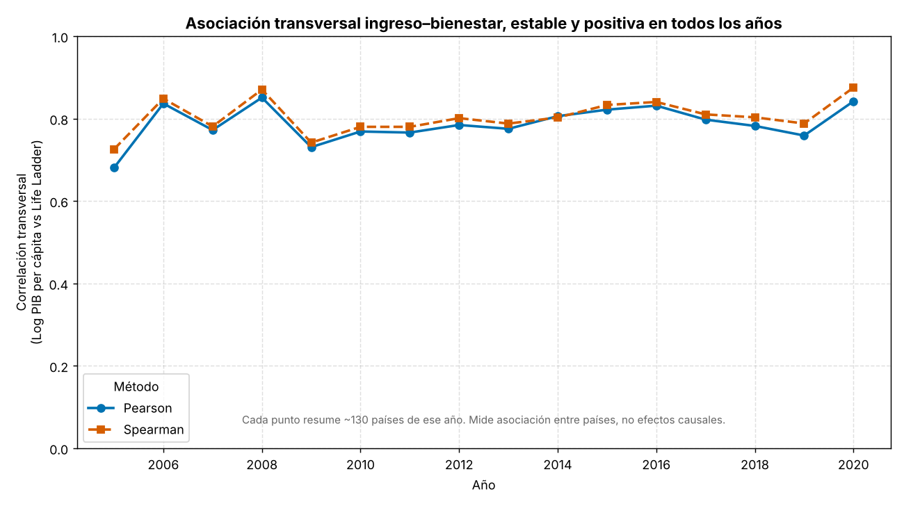
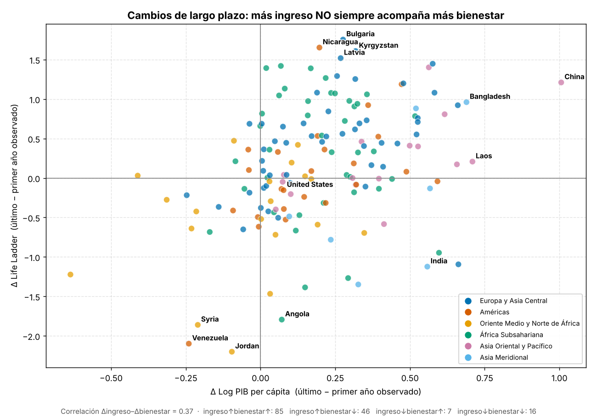

# Ingreso y bienestar de los países (2005–2020)
### Reporte de análisis — World Happiness Report

**Pregunta de investigación**

> ¿La evolución del ingreso de los países a través del tiempo está acompañada
> por cambios en sus niveles de bienestar?

**Resumen de la respuesta (adelanto).** Entre países, en cualquier año, el
ingreso y el bienestar muestran una asociación **positiva fuerte y estable**
(los países más ricos tienden a reportar mayor bienestar). Sin embargo, *a lo
largo del tiempo dentro de cada país* esa relación es **mucho más débil y
heterogénea**: cuando un país se hace más rico, su bienestar sube solo de
forma moderada en promedio, y en una fracción importante de casos no sube o
incluso baja. La evolución del ingreso, por lo tanto, **solo en parte** va
acompañada de cambios en el bienestar. *Todo lo que sigue describe
asociaciones, no relaciones causales.*

---

## 1. Datos

- **Fuente:** World Happiness Report, archivo `world-happiness-report.csv`
  del repositorio
  [Andres1984/Data-Analysis-with-R](https://raw.githubusercontent.com/Andres1984/Data-Analysis-with-R/refs/heads/master/Bases/world-happiness-report.csv).
- **Observaciones:** 1 949 filas (una fila = un país en un año).
- **Países:** 166.
- **Años:** 2005–2020 (16 años). No hay filas duplicadas de (país, año).
- **Variables (11):**

| Variable | Tipo | Rol en la visualización |
|---|---|---|
| `Country name` | texto | etiqueta |
| `year` | entero | tiempo (un año por paso) |
| `Life Ladder` | decimal | **eje Y** (bienestar subjetivo, 0–10) |
| `Log GDP per capita` | decimal | **eje X** (ingreso) |
| `Social support` | decimal | no usada en el gráfico |
| `Healthy life expectancy at birth` | decimal | **tamaño** de la burbuja |
| `Freedom to make life choices` | decimal | no usada en el gráfico |
| `Generosity` | decimal | no usada en el gráfico |
| `Perceptions of corruption` | decimal | no usada en el gráfico |
| `Positive affect` | decimal | no usada en el gráfico |
| `Negative affect` | decimal | no usada en el gráfico |

> El archivo trae un BOM UTF-8 al inicio; se carga con `encoding='utf-8-sig'`
> para que el nombre de la primera columna sea exactamente `Country name`.

### 1.1 Valores faltantes

| Variable | Faltantes | % |
|---|---|---|
| Life Ladder | 0 | 0.00 |
| Log GDP per capita | 36 | 1.85 |
| Social support | 13 | 0.67 |
| Healthy life expectancy at birth | 55 | 2.82 |
| Freedom to make life choices | 32 | 1.64 |
| Generosity | 89 | 4.57 |
| Perceptions of corruption | 110 | 5.64 |
| Positive affect | 22 | 1.13 |
| Negative affect | 16 | 0.82 |

De las tres variables que se grafican, `Life Ladder` no tiene faltantes;
`Log GDP per capita` tiene 36 (1.85 %) y `Healthy life expectancy` tiene 55
(2.82 %).

### 1.2 Cobertura por año

La cantidad de países encuestados **cambia** a lo largo del tiempo: el primer
año (2005) solo tiene 27 países —casi todos de ingreso alto— y 2020 tiene 88;
los años centrales rondan 130–142. Esto es relevante para no sobreinterpretar
la animación: el conteo de países aparece en cada cuadro del video precisamente
para hacer transparente esa cobertura cambiante. (El promedio "mundial" de 2005
no es comparable con el de otros años porque la muestra de 2005 está sesgada
hacia países ricos.)

---

## 2. Decisiones de limpieza (y por qué)

1. **Normalización de columnas:** se quitan espacios y el BOM de los nombres.
2. **Duplicados:** se verifica (país, año); no hay duplicados (0 filas).
3. **Tratamiento de faltantes — sin imputación arbitraria.** Una burbuja
   necesita coordenadas reales (X, Y) y un tamaño real. Inventar esos valores
   (p. ej. imputar la media) desplazaría burbujas a posiciones que ningún país
   ocupó y distorsionaría la lectura. Por eso se usa **eliminación por lista
   (listwise)** *únicamente* sobre las tres variables que se grafican
   (`Log GDP per capita`, `Life Ladder`, `Healthy life expectancy`). Las
   variables que **no** se grafican (p. ej. `Generosity`, con más faltantes) no
   se usan como criterio de exclusión, para no descartar observaciones válidas
   sin necesidad.
   - Filas eliminadas por faltantes en X/Y/tamaño: **73** (de 1 949 a 1 876).
   - Dataset de trabajo: **1 876 filas**, **159 países**, 2005–2020.
   - Es decir, se conserva el **96.3 %** de las observaciones.
4. **Orden:** por país y año, para cálculos y animación reproducibles.

El dataset limpio se guarda en `output/datos_limpios_animacion.csv` y el resumen
por año en `output/resumen_datos.csv`.

> **Nota sobre la región (color).** La región geográfica **no** es una variable
> de la base. Es un atributo externo y verificable (agrupación del Banco
> Mundial, consolidada en 6 grupos) que se añade **solo** como apoyo visual para
> colorear las burbujas, al estilo de Gapminder. No interviene en ningún cálculo
> ni en ninguna conclusión cuantitativa.

---

## 3. Visualización principal (animación)

Archivo: **`output/video_final.mp4`** — 1920×1080, 20 fps, 26.4 s, 528 cuadros.

- **X** = `Log GDP per capita` · **Y** = `Life Ladder` · **tamaño** =
  `Healthy life expectancy at birth` · **color** = región · **tiempo** = `year`.
- **Un año por paso.** Cada año real se sostiene ~1.5 s (varios cuadros
  idénticos para una lectura cómoda). **No se interpolan datos**: todos los
  cuadros de un año muestran exactamente los datos de ese año.
- **Ejes constantes** durante toda la animación (y escala de tamaño constante),
  para que el movimiento entre años sea comparable.
- **Año grande** como marca de agua + conteo de países del año.
- **Anti-saturación de etiquetas:** en vez de rotular ~140 países, se rotula un
  conjunto fijo y reconocible de 14 países (EE. UU., Alemania, Japón, Finlandia,
  China, India, Brasil, Rusia, Indonesia, México, Nigeria, Etiopía, Afganistán,
  Costa Rica) para poder **seguir su trayectoria**. Cada uno deja una breve
  "cola de cometa" con su recorrido de los últimos 6 años.

Cuadros estáticos de referencia: `output/figures/frame_2006.png`,
`frame_2010.png`, `frame_2015.png`, `frame_2020.png`.

---

## 4. Resultados

### 4.1 Entre países (transversal): asociación fuerte y estable

Agrupando todas las observaciones, la correlación entre `Log GDP per capita` y
`Life Ladder` es **Pearson = 0.79** y **Spearman = 0.81**. Calculada año por
año, se mantiene alta y estable en todo el período (Pearson entre **0.68 y
0.85**, mediana **0.78**).



*Lectura:* en un año cualquiera, los países con mayor ingreso tienden a reportar
mayor bienestar. Es una regularidad transversal robusta —pero es una asociación
**entre** países, no una medida de qué pasa **dentro** de un país cuando su
ingreso cambia.

### 4.2 Dentro de cada país (temporal): asociación más débil y heterogénea

Para los 135 países con al menos 8 años de datos, se calcula la correlación
temporal entre su propio ingreso y su propio bienestar:

- Correlación temporal **mediana = 0.27** (media = 0.24).
- **66.7 %** de los países muestran asociación **positiva**; **33.3 %**,
  **negativa**.

Es decir, en dos de cada tres países el bienestar tendió a moverse en la misma
dirección que el ingreso, pero la fuerza típica de esa relación es moderada, y
en un tercio de los países fue, de hecho, en sentido contrario.

### 4.3 Cambios de largo plazo (primer vs. último año)

Comparando el primer y el último año observado de cada país (155 países con ≥2
años):

- Correlación entre **Δingreso** y **Δbienestar = 0.37** (positiva, moderada).
- Reparto por cuadrantes:

| | Bienestar ↑ | Bienestar ↓ |
|---|---|---|
| **Ingreso ↑** | 85 países | **46 países** |
| **Ingreso ↓** | 7 países | 16 países |



*Lectura:* de los **131** países cuyo ingreso aumentó, **46 (35 %)** vieron
**caer** su bienestar. Casos como China o Bangladesh combinan fuertes aumentos
de ingreso y de bienestar; India aumentó su ingreso pero su `Life Ladder` bajó;
y países como Venezuela, Siria o Jordania muestran caídas marcadas de bienestar.
La heterogeneidad es la norma, no la excepción.

---

## 5. Respuesta a la pregunta

**¿La evolución del ingreso va acompañada por cambios en el bienestar?**
Parcialmente, y depende de cómo se mire:

- **Sí, entre países:** en cada año, más ingreso se asocia consistentemente con
  más bienestar (asociación transversal fuerte y estable, ~0.79).
- **Solo en parte, dentro de cada país a lo largo del tiempo:** la asociación
  temporal es positiva pero moderada (mediana ~0.27) y heterogénea; un tercio de
  los países se mueve en sentido contrario, y un 35 % de los que se enriquecieron
  reportaron menos bienestar.

En conjunto, el crecimiento del ingreso **acompaña** cambios en el bienestar de
manera imperfecta: el fuerte patrón transversal **no** se traduce en un acople
estrecho, año a año, dentro de cada país.

---

## 6. Limitaciones

1. **Asociación, no causalidad.** Ninguna correlación aquí implica que el
   ingreso *cause* el bienestar (ni viceversa). No se controlan terceros
   factores (salud, apoyo social, libertad, conflictos, cultura de respuesta a
   encuestas) ni la posible causalidad inversa.
2. **Cobertura desigual.** El número y la composición de países cambia por año
   (2005 y 2020 tienen muchos menos países). Los promedios por año no son
   estrictamente comparables; por eso el análisis se centra en asociaciones y en
   cambios *intrapaís*, y el video muestra el conteo de países en cada cuadro.
3. **Faltantes.** Se usó eliminación por lista sobre las variables graficadas
   (se descartó el 3.7 % de las filas). Un país puede "aparecer/desaparecer"
   entre años si le falta alguna de esas variables. No se imputó para no inventar
   posiciones.
4. **`Life Ladder` es subjetivo** (escalera de Cantril, autorreporte) y
   `Log GDP per capita` es una transformación logarítmica del PIB PPA; las
   lecturas deben hacerse en esas escalas.
5. **Panel no balanceado.** Las correlaciones intrapaís se calculan solo para
   países con suficientes años (≥8), lo que puede dejar fuera a algunos.

---

## 7. Reproducibilidad

Todo el pipeline se reconstruye desde cero con:

```bash
python3 src/run_all.py
```

que descarga/usa la base, la inspecciona y limpia, calcula el análisis, genera
los gráficos estáticos y produce `output/video_final.mp4`. Detalles de
dependencias y pasos en `README.md`.
